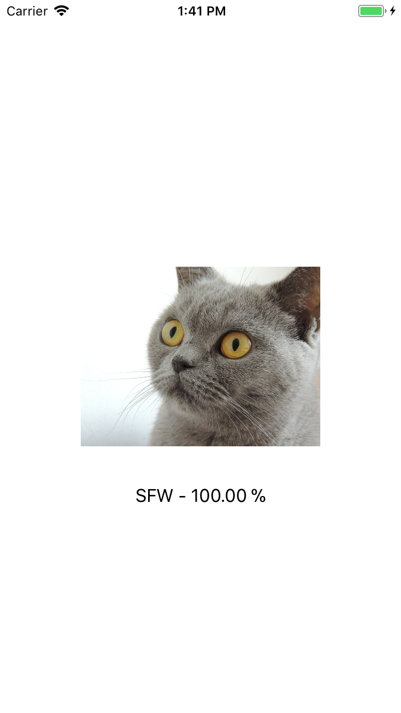

# Nudity Detection for CoreML

### Description
This is the OpenNSFW dataset implemented in Apple's new framework called CoreML. The OpenNSFW dataset can predict images as either SFW (safe for work) or NSFW (not safe for work) from images. The model was built with Caffe and is a **fine-tuned Resnet model**.

To test this model you can open the `Nudity.xcodeproj` and run it on your device (iOS 11 and Xcode 9 is required). To test further images just add them to the project and replace my testing with yours.

### Obtaining the model
*  [Download](https://drive.google.com/open?id=0B5TjkH3njRqncDJpdDB1Tkl2S2s) the model from Google Drive and drag it right into your project folder
* Convert the model on your own:
  1. Change directory:  `cd ./Convert`
  2. Change directory:  `sh convert.sh`
  
### More information
If you want to find out more how this model works and on which data it was trained on, feel free to visit the original OpenNSFW page on [Github](https://github.com/yahoo/open_nsfw)
  
### Examples
I won't show any NSFW examples for obvious reasons.

